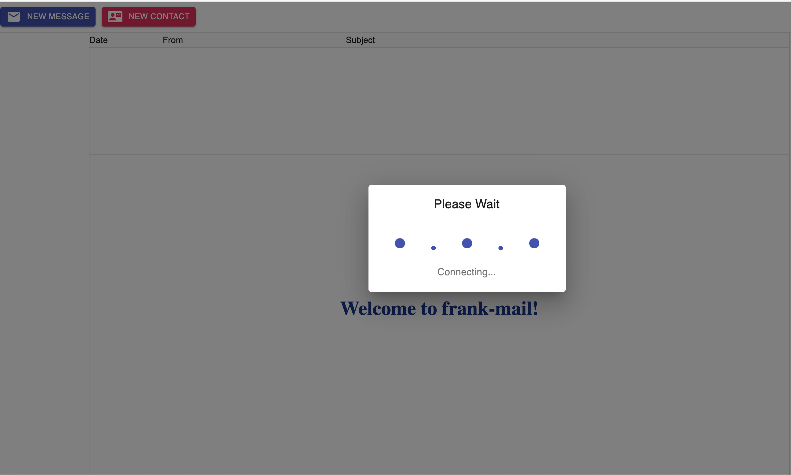
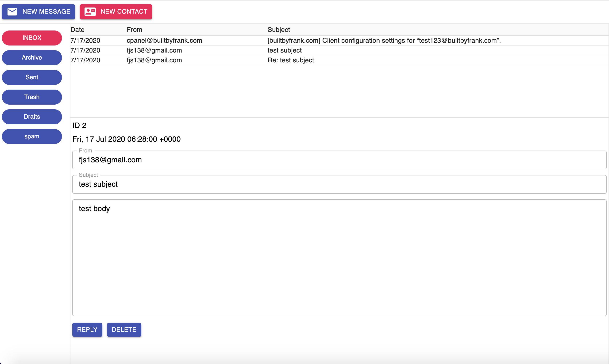
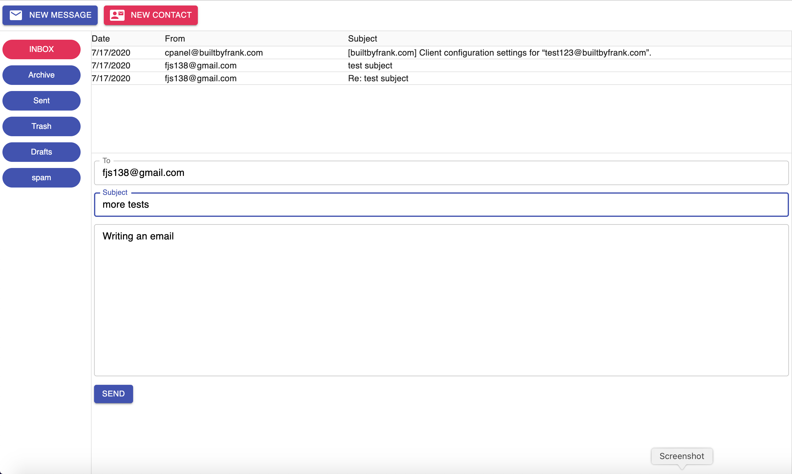

<h1 align="center">Frank Mail</h1>

<p align="center">
  A self-hosted, single-user mail server and web client — IMAP retrieval, SMTP
  delivery, and contact management, with no telemetry and no third-party
  services at runtime.
</p>

<p align="center">
  
  
  
  
  
</p>

---

## Why

Mainstream webmail reads your mail to sell you things. Frank Mail is the
opposite premise: you point it at a mail account you already control, it runs on
your own machine, and it talks to exactly two things — your IMAP server and your
SMTP server. No analytics, no ad network, no vendor account.

Honest mail. Frank Mail.

## What It Does

Frank Mail is two independently developed halves in one repository: a
Node/Express API server that speaks IMAP and SMTP, and a React client that
consumes it. The server also serves the built client, so one process runs the
whole application.

- Lists every mailbox under a single configured IMAP account
- Lists messages in a selected mailbox with date, subject, and sender
- Renders a selected message as plain text, with its server-side ID
- Deletes messages on the server
- Composes and sends new mail over SMTP
- Replies with `Re:` prepended and the original quoted below a marker
- Stores a persistent contact list, with add, delete, and compose-to actions

Mailboxes and contacts are fetched once at startup. Reselecting a mailbox
doubles as the manual refresh action.

## Screenshots

| Loading the inbox | Reading a message |
| :-- | :-- |
|  |  |

| Composing |
| :-- |
|  |

## Architecture

```
┌───────────────────────────┐         ┌────────────────────────────┐
│   React client            │  REST   │   Express server           │
│   (front-end/src/code/)   │ ──────► │   (back-end/src/)          │
│                           │  JSON   │                            │
│  state.ts   app state     │         │  main.ts   routes          │
│  IMAP.ts    Worker        │         │  IMAP.ts     ──► IMAP ─────┼──► mail server
│  SMTP.ts    Worker        │         │  SMTP.ts     ──► SMTP ─────┼──► mail server
│  Contacts.ts Worker       │         │  Contacts.ts ──► nedb      │
│                           │         │  ServerInfo.ts             │
└───────────────────────────┘         └────────────────────────────┘
         ▲                              serverInfo.json holds
         └──── served statically ───────  IMAP/SMTP credentials
               from front-end/dist
```

The client never speaks IMAP or SMTP directly. Every mail operation is a REST
call to the local server, which owns the protocol clients and the credential
file. Mail-server configuration stays entirely server-side and the client is a
plain HTTP consumer with no protocol knowledge.

Both halves use a **Worker class** pattern. `IMAP.ts`, `SMTP.ts`, and
`Contacts.ts` each expose a `Worker` encapsulating one concern, on both sides:
client-side Workers call the API, server-side Workers call the protocol
libraries. Server Workers are constructed per request and handed `serverInfo`,
so no connection state is held between calls.

Application state is centralized in `front-end/src/code/state.ts`. Components
are presentational and receive state and handlers from `BaseLayout`.

Express serves the built client from `front-end/dist` at `/`, so the server
delivers both the API and the UI on a single origin. A permissive CORS
middleware is registered to ease development against a separately served client.

## API

| Method | Route | Purpose |
| :-- | :-- | :-- |
| `GET` | `/mailboxes` | List mailboxes for the configured account |
| `GET` | `/mailboxes/:mailbox` | List message metadata in a mailbox |
| `GET` | `/messages/:mailbox/:id` | Retrieve a message body as plain text |
| `DELETE` | `/messages/:mailbox/:id` | Delete a message |
| `POST` | `/messages` | Send a message over SMTP |
| `GET` | `/contacts` | List stored contacts |
| `POST` | `/contacts` | Add a contact |
| `DELETE` | `/contacts/:id` | Delete a contact |

## Technology Stack

| Technology | Role | Why it's here |
| :-- | :-- | :-- |
| TypeScript 3.9 | Language | Static typing across both halves; shared interfaces for mailboxes, messages, and contacts |
| React 16 | Client UI | Component tree for mailbox list, message list, message view, and contacts |
| Node.js | Server runtime | Asynchronous I/O suits waiting on IMAP and SMTP round trips |
| Express 4 | HTTP framework | Defines the REST API and serves the built client |
| emailjs-imap-client | IMAP | Listing mailboxes, fetching message metadata and bodies, deleting |
| nodemailer | SMTP | Outbound message delivery |
| mailparser | Parsing | Turns raw RFC 822 sources into structured objects |
| nedb | Persistence | File-backed embedded datastore for contacts; no external database to run |
| Axios | HTTP client | Client-to-server requests |
| Material-UI 4 | Components | Widget set for the client UI |
| normalize.css | CSS reset | Consistent baseline across browsers |
| Webpack 4 + Babel | Build | Bundles both halves; `ts-loader` on the client, `tsc` on the server |
| Bit | Component sourcing | Pulls the shared loading-spinner component |

## Installation

Requires Node.js and an IMAP/SMTP account you control.

```bash
git clone https://github.com/fjs138/frank-mail.git
cd frank-mail

# Server
cd back-end
npm install

# Client
cd ../front-end
npm install
npm run build          # webpack --mode production → front-end/dist
```

### Configuration

Create `back-end/serverInfo.json` with your mail server details:

```json
{
  "smtp": {
    "host": "mail.example.com",
    "port": 587,
    "auth": { "user": "you@example.com", "pass": "your-password" }
  },
  "imap": {
    "host": "mail.example.com",
    "port": 143,
    "auth": { "user": "you@example.com", "pass": "your-password" }
  }
}
```

This file holds live credentials and should not be committed.

## Running

```bash
cd back-end
npm run compile        # tsc, then starts ./dist/main.js
```

The server listens on port 80 and serves the client at `http://localhost/`.

For iterative work, `npm run dev` runs the same compile step under nodemon,
rebuilding and restarting on any `.ts` change.

## Project Structure

| Path | Purpose |
| :-- | :-- |
| `back-end/src/main.ts` | Server entry point; middleware and all eight routes |
| `back-end/src/IMAP.ts` | IMAP Worker — list mailboxes, list messages, get body, delete |
| `back-end/src/SMTP.ts` | SMTP Worker — send messages |
| `back-end/src/Contacts.ts` | Contacts Worker — list, add, delete, backed by nedb |
| `back-end/src/ServerInfo.ts` | Loads and types `serverInfo.json` |
| `back-end/webpack.config.js` | Server build configuration |
| `front-end/src/code/main.ts` | Client entry point; mounts React |
| `front-end/src/code/state.ts` | Centralized application state and handlers |
| `front-end/src/code/IMAP.ts` | Client Worker wrapping mailbox/message calls |
| `front-end/src/code/SMTP.ts` | Client Worker wrapping the send call |
| `front-end/src/code/Contacts.ts` | Client Worker wrapping contact calls |
| `front-end/src/code/config.ts` | Client configuration — server location, user address |
| `front-end/src/code/components/` | React components |

Components: `BaseLayout` (houses all others), `Toolbar`, `MailboxList` (left),
`ContactList` (right), `MessageList`, `MessageView`, `ContactView`,
`WelcomeView`.

## Design Notes

**Why one repository for two applications.** The client and server were
developed independently and neither imports the other. They live together
because they are useless apart and versioning them separately would add
ceremony without benefit. The coupling is the REST contract, nothing more.

**Why single-user.** Credentials live in one server-side JSON file. Multi-user
support would require session management, per-user credential storage, and an
auth layer — a materially different application. Single-user keeps the security
surface at "the machine it runs on."

**Why Workers instead of shared modules.** Each protocol concern is a class with
a narrow interface, constructed per request. No connection pooling and no shared
mutable state means a failure in one request cannot corrupt another.

**Why nedb instead of a database server.** Contacts are the only persisted
application data and there are tens of them. An embedded file-backed store
removes an entire runtime dependency from the setup instructions.

**Why plain text message rendering.** Rendering untrusted HTML mail safely
requires sanitization and a sandboxed frame. Plain text sidesteps the whole
class of problem.

## Known Limitations

This is a 2020 project, kept as-is. If it were revived:

- The server binds port 80 unconditionally and has no HTTPS path
- IMAP defaults to port 143 rather than 993, so the connection is unencrypted
- CORS is set to `*`, which is appropriate for local development only
- Credentials sit in plaintext in `serverInfo.json`
- There is no test suite

## License

MIT © 2020 Frank Santaguida.

<!-- TODO: both package.json files declare "license": "ISC". Add a LICENSE file
     and make the three agree. -->
