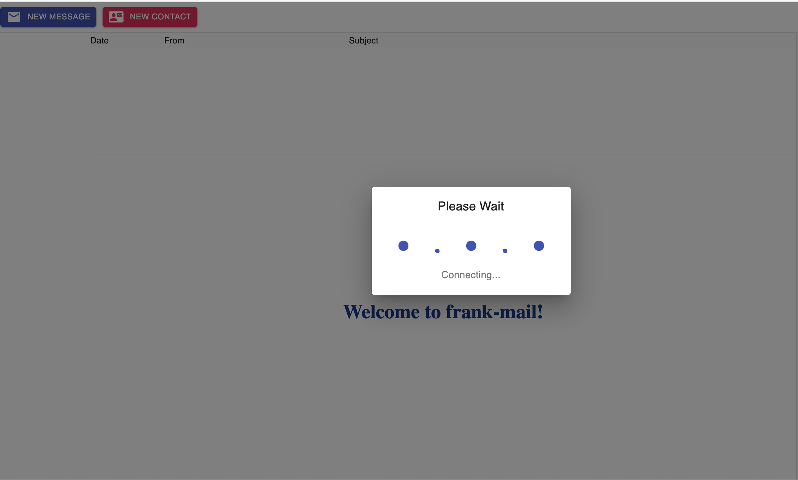
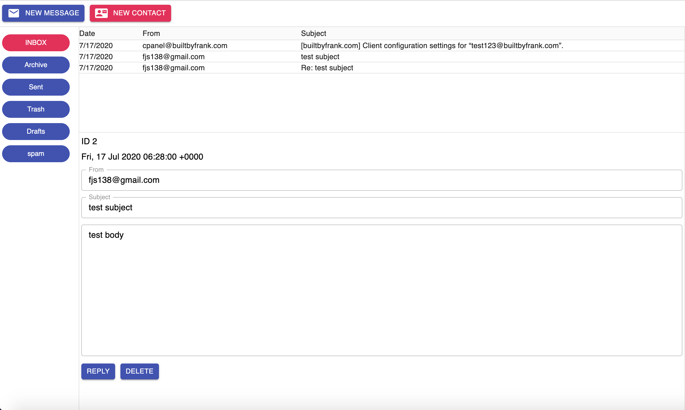
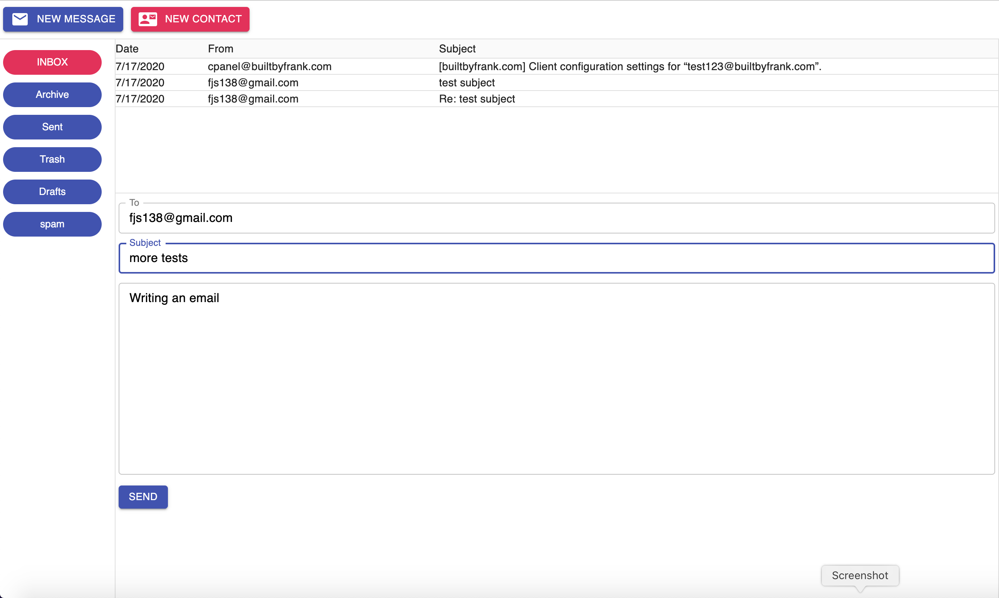

## Frank Mail
full stack webmail

## The Goal
Create a mail platform that does not collect user data, 
use advertising, and is devoid of any connections to
corporate or political entities. Honest mail. Frank Mail.

## Technology Stack

| Technology    	| Use           	  | Description     	|
| :------------------|:-------------------| :----------------	|
| Node 			| Server     | Server-side, asynchronous event-driven JavaScript runtime				  |
| React			| Front-end			  |	JavaScript library for building user interfaces            |
| REST			| data manipulation			  |	Representational State Transfer (REST) is a set of principles that, when combined, describe how common standards, HTTP usually, can be used to define a remote system interface in a client-server system. Although REST can work over other protocols, in practice it is rarely used with anything but HTTP. REST is a programming and operating system-neutral architecture.|
| nedb			| db/storage			  |	 embedded persistent File-based embedded data store for node.js or in memory data store for node.js(simple nosql database api)|
|emailjs-imap-client  |IMAP client |responsible for interacting with the IMAP server on behalf of frank-mail. It describes itself as a “low-level IMAP client for all your IMAP needs.”|
|mailparser|parser|Parse e-mails|
|nodemailer|email sender|Easy as cake e-mail sending from your Node.js applications|
| TypeScript			| css			  |	Create fast loading, highly readable, and 100% responsive interfaces with as little css as possible.          |
| Express			| data storage			  |	Fast, unopinionated, minimalist web framework for node.|
|Axios|http client|A library for server communications; Axios is a Promise-based HTTP client that works in both browsers and Node.|
|Material-UI|UI Framework|A library providing UI widgets to build our UI with based on Google’s Material guidelines|
|Bit|components|Build, distribute and collaborate on components.|

  
 • normalize.css – A CSS reset to ensure we start with a consistent
client-side environment across browsers as far as styles go
            
     

## Project Specifications

* a back-end server, that communicates with an email server 

* a front-end mail client, which will communicate with the back-end server
* the back-end server will communicate with an email server whose details will be stored in a text file on the back-end server (so this is a single-user system), 
* support for the IMAP protocol for retrieving mail
* support for the SMTP protocol for sending messages
- the back-end server will provide an API to the client that allows it to get:
    * a list of mailboxes for the account
    * a list of messages for a selected mailbox
    * relevant message details for display by the user interface
    * allow the user to delete and send messages.
    * storage of contacts, and the associated add and delete functions for maintaining them

- The mail client will provide:
    - a web-based application that can be viewed in any web browser.
    - the user a list of mailboxes in their account
    - the ability to see a list of messages within a selected mailbox
    - the ability to manipulate messages:
        - select
        - view
        - delete
        - compose
        - send
     - a contact list that allows the users to:
        - add contacts
        - delete contacts
        - compose an email to the contact
    
## Mail Client Requirements
• The server must be consulted for a list of mailboxes under a single configured IMAP account once at startup.

• The user can select a mailbox from the list, which will double as a refresh action. The messages will be displayed in a tabular form and will show the date received, subject, and sender.

• Clicking a message shows it below the list, including subject, sender, ID on the server, date received, and, of course, the message itself, as plain text.

• The user must be able to delete the message being viewed.

• The user can begin a new message in reply to the message being viewed. The subject will automatically have “Re:” prepended to it, and the original message will be shown below a bit of marker text.

• A list of contacts will be stored on the server. The user can select a contact from a list and can delete the contact or begin a message to them. They can also, of course, add a new contact.

• Like mailboxes, the server will be consulted once at startup for the list of contacts.

## Anatomy of Project

| File/Folder    	| Purpose           	  |
| :------------------|:-------------------|
| back-end/		 			| backend|
| front-end/		 			| frontend    |
| front-end/src/code/components	 			| React components     |

front-end Source File Rundown:
* src/index.html – The main entry point of the application.
* src/css/main.css – standard CSS file with some shared styles.
* src/code/main.ts – The main code entry point. This is where React will begin to build our UI from.
* src/code/Contacts.ts – Like the server, this is the file that contains a Worker class for dealing with contacts (this is what talks to the server side of frank-mail for contacts).
* src/code/IMAP.ts – Like Contacts.ts, this contains a Worker for performing all the IMAP functions, in conjunction with the server.
* src/code/SMTP.ts – Just like IMAP.ts, but for the SMTP (send) functionality.
* src/code/config.ts – A simple configuration file that will contain information about the server component and your email address.
* src/code/state.ts – This is where most of the action of the app actually is
* src/code/components/BaseLayout.tsx – A React component that houses all others.
* src/code/components/Toolbar.tsx – A React component that is the toolbar.
* src/code/components/MaliboxList.tsx – A React component that is the list of mailboxes on the left.
* src/code/components/ContactList.tsx – A React component that is the list of contacts on the right.
* src/code/components/MessageList.tsx – A React component that is a list of messages in a selected mailbox.
* src/code/components/WelcomeView.tsx – A React component that serves as just a simple splash screen when the app starts up or when certain operations occur.
* src/code/components/ContactView.tsx – A React component that is the presentation of the contact view when a contact is selected or a new one is being created.
* src/code/components/MessageView.tsx – A React component that is the presentation of a message or when a message is being composed.

back-end Source File Rundown:
* main.ts – This is the main entry point and is where the functions that will constitute the API the server presents to the client are defined.
* ServerInfo.ts – This will be a configuration file that provides details about the IMAP and SMTP server(s) the server will connect to and where that information will be stored.
* IMAP.ts – Code that talks to an IMAP server to list mailboxes and messages and to retrieve messages. There will be a Worker class within this. That is what the rest of the application code will use, along with some interfaces it’ll need.
* SMTP.ts – Code that talks to an SMTP server to send messages. Like IMAP, this will have a Worker class.
* contacts.ts – Code dealing with contacts (listing, adding, and deleting them). Once again, a Worker class will be present, along with an interface to describe a contact object.
In addition to those, wis the config file for IMAP and SMTP server information stored in the /server directory named serverInfo.json.

## Endpoints
* List Mailboxes
* List Messages
* Get a Message
* Delete a Message
* Send a Message 
* Delete a Message 
* Send a Message
* List Contacts
* Add Contact
* Delete Contact

# Launch
run node against /back-end/dist/main.js
open front-end/dist/index.html in your browser

## Loading Inbox

## Reading Email

## Composing Email

## Note
It seemed more appropriate to keep the front-end and back-end together in one repository,
but they were developed independently and are not truly dependent on one-another.

front-end is the react front-end

back-end is the node server back-end

## License
MIT License

Copyright (c) 2015 Frank Santaguida

Permission is hereby granted, free of charge, to any person obtaining a copy
of this software and associated documentation files (the "Software"), to deal
in the Software without restriction, including without limitation the rights
to use, copy, modify, merge, publish, distribute, sublicense, and/or sell
copies of the Software, and to permit persons to whom the Software is
furnished to do so, subject to the following conditions:

The above copyright notice and this permission notice shall be included in all
copies or substantial portions of the Software.

THE SOFTWARE IS PROVIDED "AS IS", WITHOUT WARRANTY OF ANY KIND, EXPRESS OR
IMPLIED, INCLUDING BUT NOT LIMITED TO THE WARRANTIES OF MERCHANTABILITY,
FITNESS FOR A PARTICULAR PURPOSE AND NONINFRINGEMENT. IN NO EVENT SHALL THE
AUTHORS OR COPYRIGHT HOLDERS BE LIABLE FOR ANY CLAIM, DAMAGES OR OTHER
LIABILITY, WHETHER IN AN ACTION OF CONTRACT, TORT OR OTHERWISE, ARISING FROM,
OUT OF OR IN CONNECTION WITH THE SOFTWARE OR THE USE OR OTHER DEALINGS IN THE
SOFTWARE.
